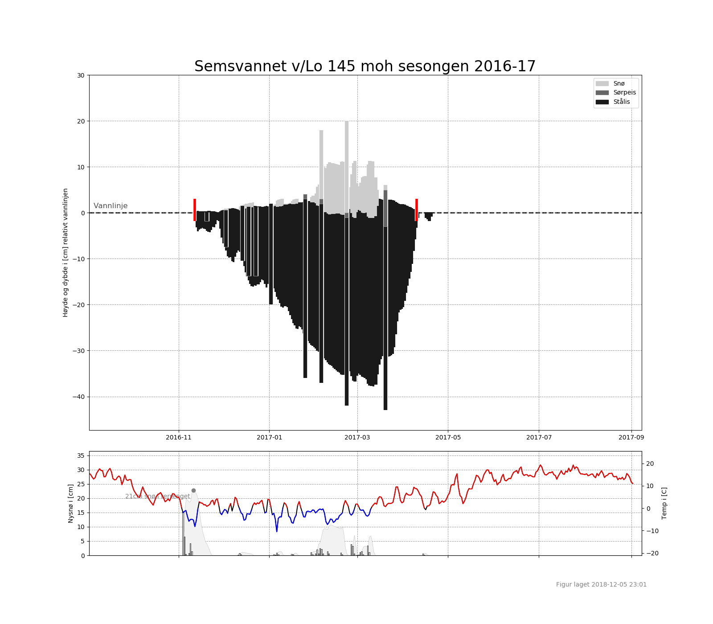
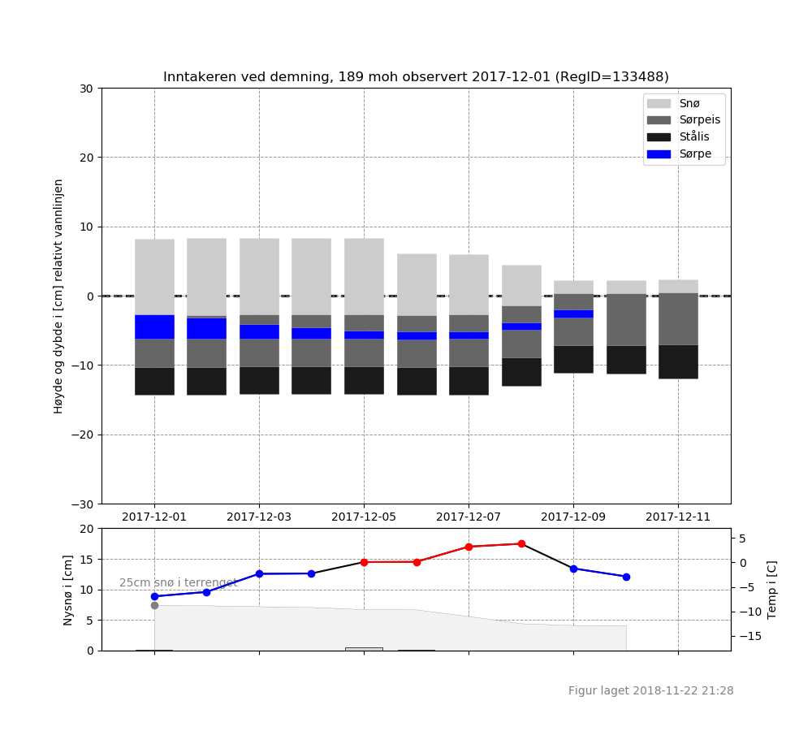

# icemodelling
A one dimensional ice thickness model.

## About the model
We model the ice thickness evolution given daily averages for temperatures and precipitation (preferably new sno).

### The math and methods
With these few parameters we:
* Model ice thickness, including the thin ice growth approach suggested by Ashton in his paper in 1989.
* We model buoyancy change when the snow weighs down the ice, thus at some critical level water flows through the ice and slush an slush ice layers are created.
* The dry snow sno is compacted.
* Cloudless skies decrease the temperature.
* Cloudless skies are estimated from precipitation days if otherwise not given.
* Temperature may be elevation corrected if the temperature data is from a different elevation than the lake being modeled.
* Melting of snow, ice and slush is preformed with a degree day model.

Weather data may come from:
* File.
* Norwegian Met office's eKlima web service.
* NVE's gridded time series (GTS) web service which includes the 9 day modeled weather forecast.
* NVE's chart server which includes the 9 day modeled weather forecast.
* Yr.no and only 9 day modeled weather forecast.

Observations of ice thickness and ice coverage may be used to initiate the model, and observations may be assimilated to correct the modelled ice evolution in a season plot. Input may be:
* File.
* regObs observation type ice cover retrieved from the regObs web api.
* regObs observation type ice thickness from the regObs web api.

### Use
For daily operations and based on observations from regObs, the model is used to calculate seasonal ice evolution on all lakes with sufficient observations. Sufficient observations being enough to estimate an initiation date to start calculating daily ice thickness change.

We also calculate a 9 day prognosis for all ice thickness observed in regObs.

These plots are presented on [iskart.no](http://www.iskart.no/) along with observations.

### Performance
There is still allot of work to be done on the model. But it does a decent job in the big picture.

Based on the 1093 observations of ice coverage and ice thickness during the winter 2017-18, and based on the gridded time series data provided by the GTS the model gains a Nash-Sutcliffe model efficiency coefficient of 0.44.
{:height="50%" width="50%"}

## Getting started
These instructions will get you a copy of the project up and running on your local machine.

### Prerequisites
The model is written in Python 3 and with Anaconda 3 you have what you need to run the model.

### Installing
I'm getting back to more info here.

